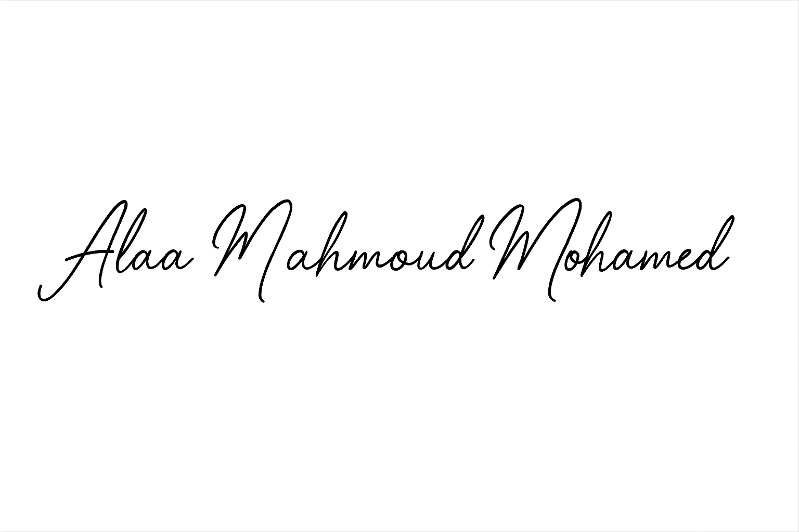

# 👋 Hi, I'm Alaa Mahmoud Mohamed

📍 Cairo, Egypt • 💬 “Security through Knowledge — Knowledge through Sharing”  
🧩 Part of the CSG Defense Stack Initiative (Ethical, Private, AI-Driven Security)

---

## 🧠 About Me
I’m a cybersecurity developer passionate about creating intelligent defense systems powered by AI and developing open-source tools for a safer, more reliable digital environment.
I focus on transforming complex security concepts into practical solutions that enhance protection while upholding transparency and user safety.

---

## ⚙️ Technical Stack

---

## 🧰 Tools & Platforms

---

## 🏆 Certifications

---

## 📊 GitHub Stats & Highlights
## 📊 GitHub Stats & Highlights

  
   
  
   
  

---

## 🚀 Featured Projects

| Cyber Security Guard (Main) | VPN GUARD (SCG) | LinkGarde (CSG) | Cyber Guard Framework |
|-----------------------------|-----------------|-----------------|-----------------------|
|  |  |  |  |

> 🧠 All projects are part of the Cyber Security Guard Ecosystem (CSG Defense Stack) — built with privacy, efficiency, and local-first design in mind.

---

## 🔗 Extended Visuals

### 👀 Special Alignment

 
 
 

### 🎨 Other Visuals

 
 
 

### 🖼️ Central Highlight

---

## 🌐 Connect With Me

---

⭐ Always Learning — Always Building ⭐  
Securing Tomorrow, One Line of Code at a Time.

---

## 🖼️ Branding & Visual Identity

| Project | Logo | Description |
|----------|------|--------------|
| Cyber Security Guard (CSG) |  | النظام الأمني الأساسي متعدد الطبقات. |
| Cyber Guard |  | واجهة الحماية الذكية المخصصة للمراقبة والتحليل. |
| VPN GUARD (SCG) |  | منصة الاتصال الآمن VPN المرتبطة بمنظومة CSG. |
| LinkGarde.CSG |  | أداة فحص وتحليل الروابط والمصادر الخارجية. |

---

### 🔏 Digital Signature  
  
Secured by CSG Framework — 2025

> 🧩 Visuals designed & optimized by Alaa Mahmoud Mohamed.  
> 🧠 Ethical AI & Cybersecurity Tools — Empowering real defense.
